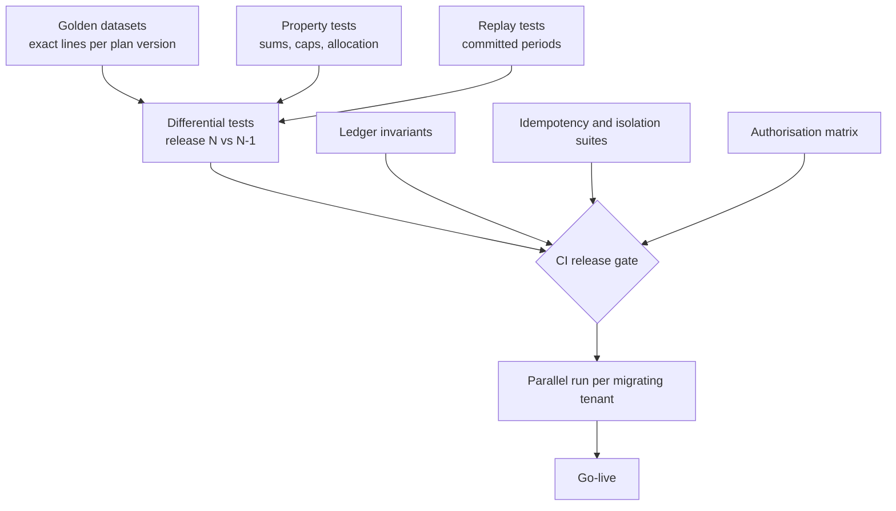

## Coverage by layer

```mermaid
flowchart TB
  G[Golden datasets<br/>exact lines per plan version] --> D[Differential tests<br/>release N vs N-1]
  P[Property tests<br/>sums, caps, allocation] --> D
  R[Replay tests<br/>committed periods] --> D
  D --> GATE{CI release gate}
  L[Ledger invariants] --> GATE
  I[Idempotency and isolation suites] --> GATE
  A[Authorisation matrix] --> GATE
  GATE --> PR[Parallel run per migrating tenant] --> GL[Go-live]
```
